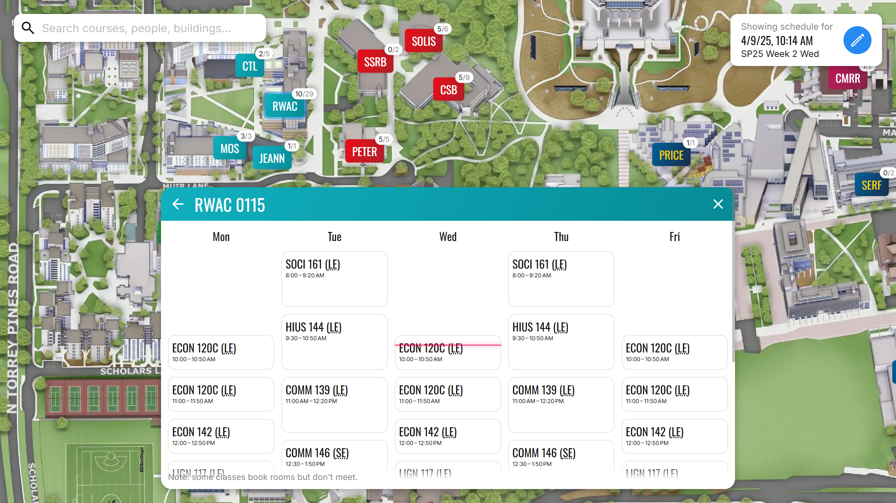

# UCSD classroom schedules

[Live](https://sheeptester.github.io/ucsd-classrooms/)



## Features

- **Checking when a classroom is available.** Does RWAC 0935 have classes in it? When are they?
  - Feature: schedule for each room.
- **Finding ongoing lectures nearby to crash.** I'm sitting in the Jeannie studying as the next lecture comes in. What course is it for?
  - Feature: map of buildings.
- **Finding available classrooms during a specific time.** Spencer is available to teach juggling at 3 pm. What classroom can he teach it in?
  - Feature: changing the "current" time.
- **Getting the start and end dates of each quarter.** The internship application asks when I'm available to start. When does spring end? I'm too lazy to find that enrollment calendar website.
  - Feature: calendar view with quarters marked out.
- **Converting between month/day dates and quarter weeks.** May 15, what week is that?
  - Feature: calendar view with week numbers.
- **Looking up the lecture location for a class.** I'll crash ECE 100. Where is it? I'm too lazy to sign into WebReg, and searching up courses on there is slow.
  - Feature: search courses by course code, list meeting times/locations for a course.
- **Finding buildings by their code on the map.** Where is RECGM?
  - Feature: search buildings by code.
- **Finding what classes are taught by a professor this quarter.** What classes is Sworder teaching next quarter?
  - Feature: search sections by professor.
- **Determining when a professor is free.** I want to schedule a meeting with my professor. When might they be free?
  - Feature: calendar view for a professor.
- **Guiding students to buildings.** Where is Mosaic? It's next to Wolftown.
  - Feature: link to buildings directly, include photos of buildings.

Features to add:

- [x] Scrape data from schedule of classes rather than WebReg (so it doesn't require authentication)
- [x] Search by professor and course code
- [x] Set current time so can see what classrooms are available at a given date/time
- [x] Use Pacific Time regardless of browser time zone

- [x] Load summer session 3 when needed
- [ ] Handle co-scheduled courses
- [x] Show when the quarter's data was last refreshed
- [x] Show all images for building

- [x] Support using back/forward for modals
- [x] Permalink buildings, courses, and professors
- [x] Permalink dates
- [ ] Simplify term selection

## Development

```shell
# Builds to dist/
$ npm run build

# Serves to http://localhost:8000/
# Note: Imgur is blocked on 127.0.0.1. https://stackoverflow.com/a/43910367
$ npm run dev
```

Map image was made with [this tool](https://sheeptester.github.io/words-go-here/misc/ucsd-map.html) (zoom 17, x: -6 to 5, y: -6 to 5).
Then, compress to a WebP with [Squoosh](https://squoosh.app/), quality 60.
